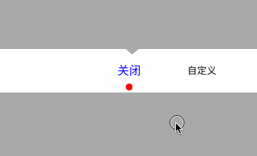

# JFEQScrollViewPicker

轮播按钮，菜单  

1.使用接口：   

@protocol JFEQScrollViewDelegate <NSObject>

-(void)scrollButtonClickIndex:(NSInteger)index;

@end

-@property (nonatomic,unsafe_unretained)id <JFEQScrollViewDelegate> delegate;

2.使用例子：   

添加轮播按钮
JFEQScrollViewPicker *eqScrollView = [[JFEQScrollViewPicker alloc] initWithFrame:CGRectMake(0, 200, self.view.frame.size.width, 63)];
eqScrollView.delegate = self;
[self.view addSubview:eqScrollView];  
    
3.效果：   

